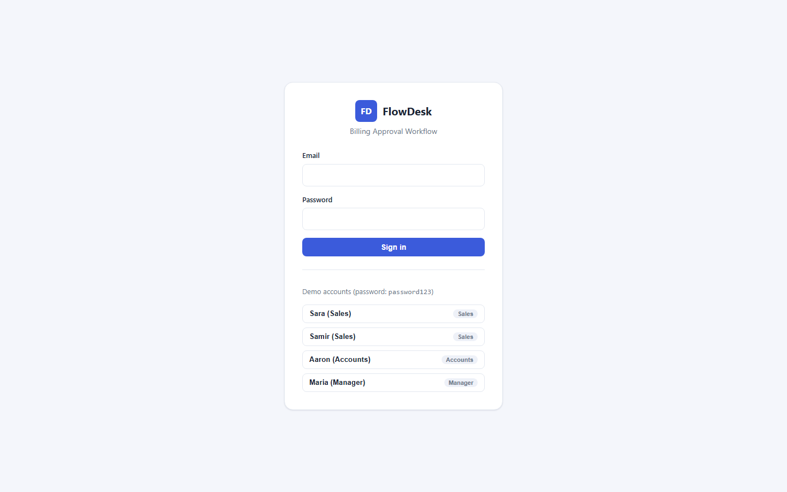
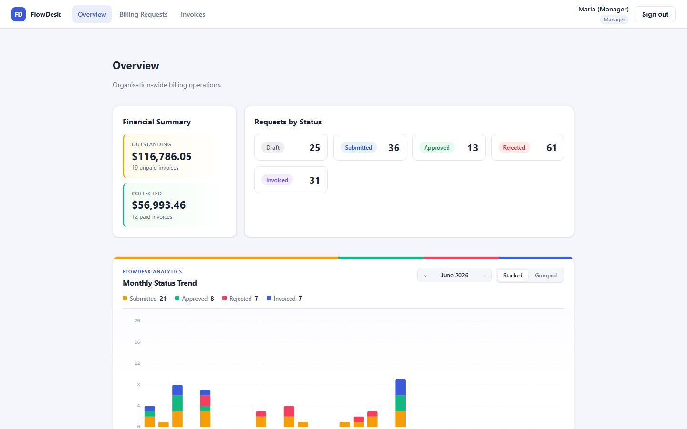
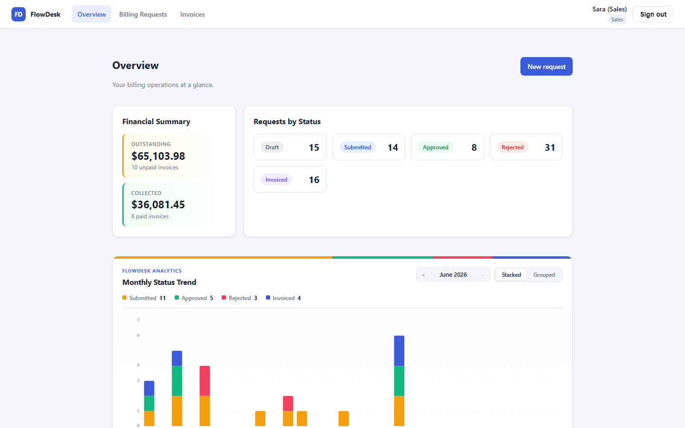
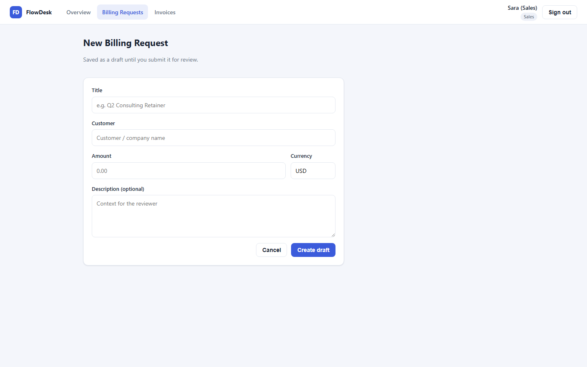
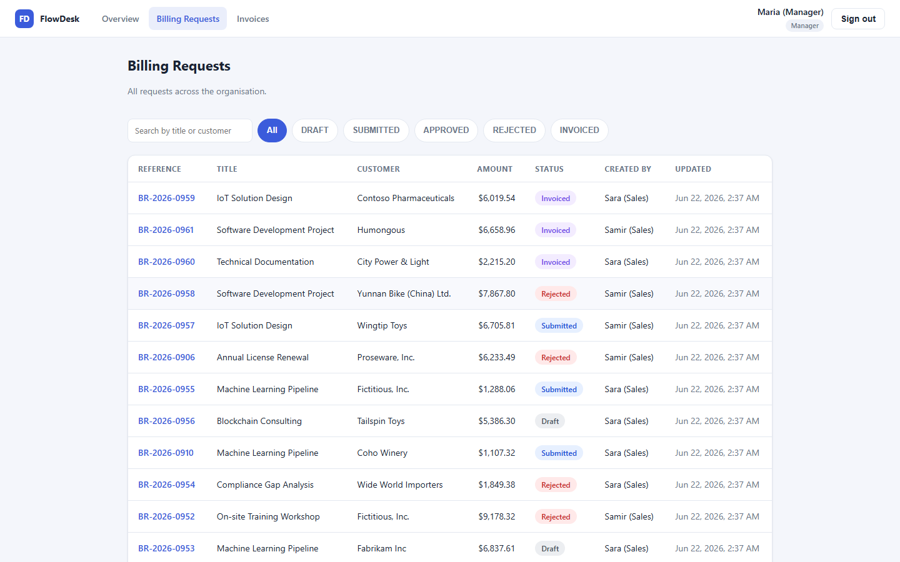
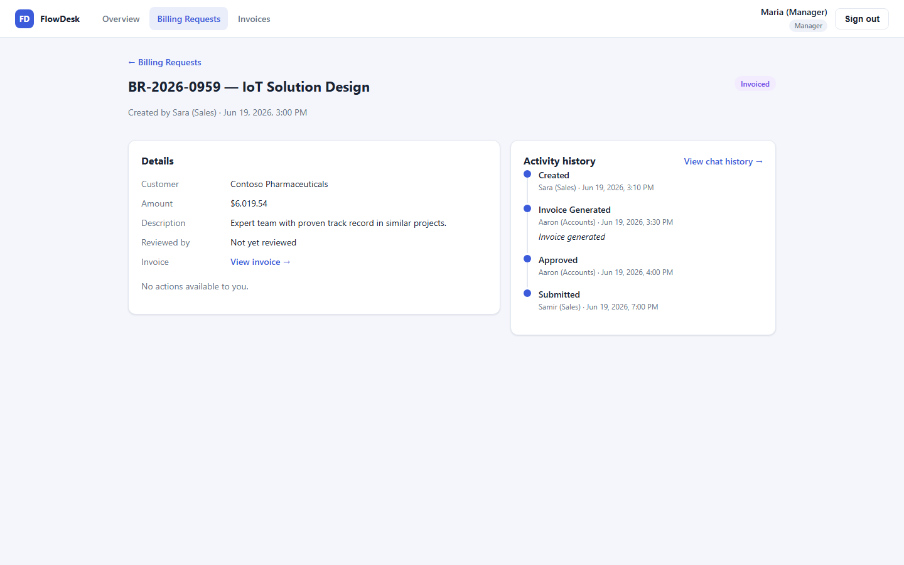
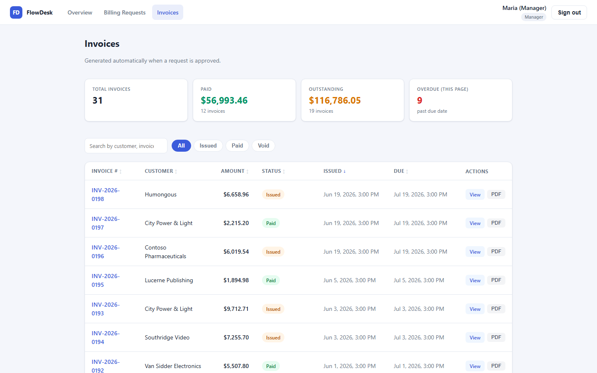
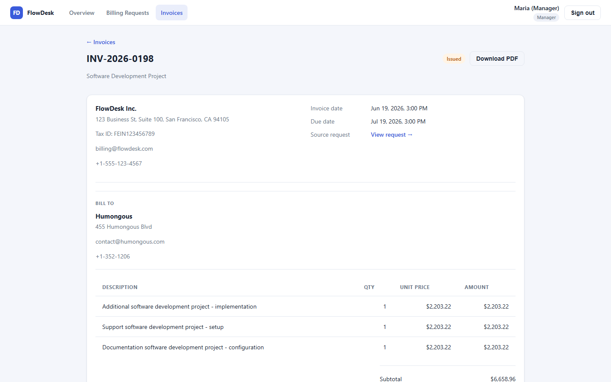

# FlowDesk — Billing Approval Workflow

> A production-shaped ERP workflow module that turns a billing request into a tracked, auditable, invoice-generating pipeline.

FlowDesk eliminates manual coordination between **Sales**, **Accounts**, and **Management** by enforcing a strict state machine, auto-generating invoices on approval, and surfacing everything on a unified analytics dashboard.

```
Sales creates a billing request
  → Accounts reviews (approve / reject)
    → on approval, an invoice is generated asynchronously (BullMQ)
      → Accounts marks it paid, downloads the PDF
        → Management monitors it all in real time on the Overview dashboard
```

Every state change is **role-guarded**, written to an **append-only audit trail**, and reflected immediately in the live dashboard — so at any moment you can answer *who did what, when, and why*.

---

## Table of Contents

1. [Quick Start (Docker)](#quick-start-docker)
2. [Demo Accounts](#demo-accounts)
3. [Screenshots](#screenshots)
4. [Features](#features)
5. [Key User Flows](#key-user-flows)
6. [Architecture](#architecture)
7. [Read / Write Database Splitting](#readwrite-database-splitting)
8. [Tech Stack & Rationale](#tech-stack--rationale)
9. [Data Model](#data-model)
10. [Workflow State Machine](#workflow-state-machine)
11. [Overview Dashboard](#overview-dashboard)
12. [Invoice Module](#invoice-module)
13. [Search & Pagination](#search--pagination)
14. [Analytics & Reporting](#analytics--reporting)
15. [API Reference](#api-reference)
16. [Project Structure](#project-structure)
17. [Environments & Scripts](#environments--scripts)
18. [Testing](#testing)
19. [Security & Access Control](#security--access-control)
20. [Assumptions](#assumptions)
21. [What I'd Improve with More Time](#whatid-improve-with-more-time)

---

## Quick Start (Docker)

**Prerequisites:** Docker Desktop (or Engine + Compose v2). No Node.js, paid services, or external credentials needed.

```bash
# 1. Clone
git clone <repo-url>
cd flowdesk

# 2. Start the full stack (Postgres + Redis + API + Web)
docker compose up --build

# 3. Open the app
#    Web:     http://localhost:8080
#    API:     http://localhost:3000/api/v1
#    Swagger: http://localhost:3000/api/docs
```

On startup the API container automatically **runs migrations** and **seeds demo data** (idempotent). First build takes ~2 minutes; subsequent runs are cached.

```bash
# Verify
curl http://localhost:3000/api/v1/health
# {"status":"ok","database":"up", ...}
```

```bash
# Reset to a clean slate
docker compose down -v && docker compose up --build
```

| Surface | URL |
|---|---|
| Web app | http://localhost:8080 |
| API base | http://localhost:3000/api/v1 |
| Swagger UI | http://localhost:3000/api/docs |
| Health check | http://localhost:3000/api/v1/health |

---

## Demo Accounts

All accounts use the password **`password123`**. The login screen lists them with one-click fill.

| Role | Email | Permissions |
|---|---|---|
| **Sales** | `sales@flowdesk.dev` | Create / edit / submit / revise own requests |
| **Sales** | `sales2@flowdesk.dev` | Second sales user (demonstrates ownership scoping) |
| **Accounts** | `accounts@flowdesk.dev` | Approve / reject requests · mark invoices paid · download PDFs |
| **Manager** | `manager@flowdesk.dev` | Read-only org-wide dashboards, metrics, charts |

---

## Screenshots

<table>
<tr>
<td align="center" width="50%">
<strong>Sign in</strong><br/>
Role-aware demo account selector
<br/><br/>

</td>
<td align="center" width="50%">
<strong>Overview Dashboard — Manager view</strong><br/>
Financial summary · status breakdown · daily status trend
<br/><br/>

</td>
</tr>
<tr>
<td align="center" width="50%">
<strong>Overview Dashboard — Sales view</strong><br/>
Scoped to own requests · New Request CTA
<br/><br/>

</td>
<td align="center" width="50%">
<strong>New Billing Request</strong><br/>
Draft creation form for Sales users
<br/><br/>

</td>
</tr>
<tr>
<td align="center" width="50%">
<strong>Billing Requests List</strong><br/>
Paginated · searchable · filterable by status
<br/><br/>

</td>
<td align="center" width="50%">
<strong>Request Detail & Audit Trail</strong><br/>
Workflow actions · full immutable audit timeline
<br/><br/>

</td>
</tr>
<tr>
<td align="center" width="50%">
<strong>Invoices List</strong><br/>
Sortable columns · status filter chips · overdue highlights · PDF download
<br/><br/>

</td>
<td align="center" width="50%">
<strong>Invoice Detail</strong><br/>
Legal document layout · issuer · bill-to · line items · totals · PDF export
<br/><br/>

</td>
</tr>
</table>

---

## Features

### Billing Workflow
- **Explicit state machine** — `DRAFT → SUBMITTED → APPROVED → INVOICED`, with `SUBMITTED → REJECTED → DRAFT` rejection loop. All transitions are role-guarded and enforced server-side.
- **Role-based access control** — Sales creates/submits; Accounts approves/rejects; Manager is read-only. Ownership checks ensure Sales can only act on their own requests.
- **Rejection with reason** — Accounts provides a mandatory reason on rejection; Sales sees it as a callout and can revise and resubmit.
- **Append-only audit trail** — every state change, edit, and system action is recorded with actor, timestamp, and metadata in a tamper-proof `AuditLog` table, written atomically with the state change.

### Invoice Generation
- **Automatic async invoice generation** — on approval a BullMQ job is enqueued; a background worker generates the invoice and flips the request to `INVOICED` inside a single transaction. Approval stays fast.
- **Idempotent worker** — retries find the existing invoice and no-op; safe against double-processing.
- **Legal document snapshot** — issuer info, bill-to details, and line items are captured at generation time so the document remains accurate even if source data later changes.
- **Structured line items** — each invoice contains itemised line items (description, quantity, unit price) with correct totals math (subtotal → discount → tax → grand total), all stored as integer cents for precision.
- **PDF export** — `GET /invoices/:id/pdf` streams a professional A4 PDF directly (pdfkit, no temp files), available to all roles for their permitted invoices.
- **Mark as paid** — Accounts users can mark an `ISSUED` invoice as `PAID`.

### Unified Overview Dashboard
- **Financial summary** — outstanding invoice total (with unpaid count) and collected total (with paid count), pulled from the metrics API.
- **Requests by Status** — clickable quick-link grid showing live counts per status; each chip navigates to the pre-filtered requests list.
- **Monthly Status Trend** — full-width interactive Canvas 2D chart showing daily Submitted / Approved / Rejected / Invoiced event counts for a selected month, with stacked/grouped toggle, hover tooltip, Pipeline Pulse ribbon, and month navigation up to 6 months back.
- **Scope-aware** — Sales users see metrics scoped to their own requests; Manager and Accounts see org-wide data.

### Invoices Page
- **Summary metric cards** — outstanding balance, collected total, and overdue count at the top.
- **Sortable columns** — click any column header to sort ascending/descending (Invoice #, Customer, Amount, Status, Issued, Due).
- **Status filter chips** — All / Issued / Paid / Void client-side filter applied on top of the paginated API response.
- **Overdue row highlighting** — rows with `ISSUED` status past their due date are visually flagged with an amber background and "Overdue" badge.
- **Per-row actions** — View (navigates to detail) and PDF (downloads inline) on every row.

### Search & Pagination
- **Debounced full-text search** — 300 ms debounce on both Billing Requests and Invoices lists; searches `title + customerName` / `invoiceNumber + billToName`.
- **URL-persisted state** — search term and current page live in the query string, making results shareable and browser-refresh-safe.
- **Paginated backend** — all list endpoints return `{ data, pagination: { page, pageSize, total, totalPages } }`.
- **Pagination controls** — Prev / Next with "Showing X–Y of Z" count; only rendered when `totalPages > 1`.

### Developer Experience
- **Swagger UI** — fully documented interactive API at `/api/docs`.
- **Typed end-to-end** — shared TypeScript types across the API boundary via `web/src/api/types.ts`.
- **Three test layers** — Jest unit tests, Jest + Supertest API e2e tests, Playwright browser e2e tests (21 UI tests across 4 spec files).
- **Playwright screenshot script** — `docs/take-screenshots.js` regenerates all README screenshots from the live app.
- **One-command stack** — `docker compose up --build` is the only thing a reviewer needs.
- **Read/write database splitting** — writes to primary, round-robin reads across replicas (transparent single-DB fallback for local dev).

---

## Key User Flows

1. **Create & submit (Sales)** — Sara logs in, creates a draft request, edits it while it's a `DRAFT`, then submits it for review.
2. **Approve (Accounts)** — Aaron opens the submitted request, reviews the details and audit history, and approves it.
3. **Auto-invoicing (System)** — a BullMQ worker picks up the job, generates the invoice with line items and a 30-day due date, flips the request to `INVOICED`, and logs the audit entry — all without blocking Aaron's approval response.
4. **Reject & revise (Sales / Accounts)** — Aaron rejects with a mandatory reason; Sara sees the callout, opens the request back to `DRAFT`, fixes it, and resubmits.
5. **Mark paid & download PDF (Accounts)** — Aaron opens the generated invoice, marks it paid, and downloads the PDF for the customer record.
6. **Monitor (Manager)** — Maria opens the Overview dashboard, sees the financial summary, the org-wide status breakdown, and the monthly status trend chart — all scoped to the full organisation.

---

## Architecture

```
                       ┌──────────────────────────────────────────────┐
                       │               Browser (React SPA)             │
                       │   TanStack Query · React Router · Canvas 2D   │
                       └───────────────────────┬──────────────────────┘
                                               │  HTTP  (same-origin /api/v1)
                       ┌───────────────────────▼──────────────────────┐
                       │         web container (nginx)                 │
                       │   serves static build · proxies /api → api    │
                       └───────────────────────┬──────────────────────┘
                                               │
                       ┌───────────────────────▼──────────────────────┐
                       │            api container (NestJS)             │
                       │                                               │
                       │  Controller → Service → Repository            │
                       │  (HTTP)       (domain)   (persistence)        │
                       │                                               │
                       │  Guards:  JwtAuthGuard → RolesGuard           │
                       │  Global:  ValidationPipe · ExceptionFilter    │
                       └───────┬──────────────┬────────────────┬───────┘
                               │              │                │
                    Prisma ORM │   enqueue    │ BullMQ         │ Prisma
                               ▼              ▼                ▼
                     ┌──────────────┐  ┌────────────┐   Invoice worker
                     │  PostgreSQL  │  │   Redis    │   (same process)
                     │  state +     │  │  job queue │   creates invoice +
                     │  audit log   │  └──────┬─────┘   flips → INVOICED
                     └──────▲───────┘         │         (atomic transaction)
                            └─────────────────┘
```

**Request lifecycle:**
```
HTTP request
  → ValidationPipe       (DTO validation, whitelist, transform)
  → JwtAuthGuard         (verify JWT, attach principal)
  → RolesGuard           (enforce @Roles decorator)
  → Controller           (routing only — no business logic)
  → Service              (workflow rules, ownership, audit)
  → Repository           (Prisma; uses transactions for atomicity)
  → PostgreSQL
  ← AllExceptionsFilter  (wraps every error in a consistent envelope)
```

**Async path (on approval):** service commits `APPROVED` and enqueues a `generate-invoice` job. The BullMQ worker creates the invoice, writes audit entry, and flips the request to `INVOICED` — all inside one transaction. The job is idempotent (retry finds the existing invoice and no-ops) and retries with exponential backoff on failure.

---

## Read/Write Database Splitting

All **writes** and **transactions** use `prisma.primary`; all **reads** use `prisma.reader`, which round-robins across any number of configured replicas.

```
prisma.primary ──► PRIMARY (postgres)
                      │  WAL streaming replication
           ┌──────────┼──────────┐
           ▼          ▼          ▼
       replica 1   replica 2   ...    ◄── prisma.reader (round-robin)
```

`PrismaService` holds a primary client plus one client per replica. Repositories call the correct client; a read inside a write transaction automatically hits the primary through the transaction client.

**Self-contained by default.** Replicas are configured via `DATABASE_REPLICA_URLS` (comma-separated). When empty, `reader` falls back transparently to the primary — `docker compose up --build` works with zero configuration.

```bash
# Optional: spin up a real primary + streaming replica
docker compose -f docker-compose.yml -f docker-compose.replica.yml up --build
```

---

## Tech Stack & Rationale

| Concern | Choice | Rationale |
|---|---|---|
| Backend | **NestJS + TypeScript** | First-class DI and module boundaries make the Controller → Service → Repository separation natural and independently testable. |
| ORM | **Prisma** | Type-safe queries, readable single-file schema, first-class migrations. |
| Database | **PostgreSQL** | Relational integrity for FK constraints, enums, and audit table; transactions keep state + audit consistent; streaming replication for read/write split. |
| Queue | **BullMQ + Redis** | Invoice generation off the request path with retries and idempotency — a real reason to use a queue. |
| Frontend | **React + Vite + TypeScript** | Lightweight SPA; **TanStack Query** gives server-state management with loading/error/empty handling out of the box. |
| Charts | **Canvas 2D** | Custom Canvas renderer for the Monthly Status Trend chart — imperative drawing with smooth animations, DPR handling, and ResizeObserver. No chart library dependency. |
| PDF export | **pdfkit** | Pure Node.js; streams an A4 PDF directly to the HTTP response — no temp files, no headless browser. |
| Auth | **JWT** | Sufficient to demonstrate authn/authz cleanly without over-investing in the auth layer. |
| Deployment | **Docker Compose** | One command brings up the full stack, self-contained. |

**Notable design choices:**

- **State machine over scattered `if` checks** — all transitions, allowed roles, and ownership rules live in one declarative [`workflow.ts`](api/src/modules/billing-requests/workflow.ts).
- **Audit written in the same transaction as the state change** — an action and its record can never diverge.
- **Money stored as integer cents** — avoids floating-point drift; conversion to display values happens only at the API/UI boundary.
- **Invoice as a legal snapshot** — issuer, bill-to, and line items are copied at generation time so the document remains accurate even if source data later changes.
- **Audit log as event source for charts** — charts count `AuditLog.toStatus` events per day/month, not live status distributions. This measures *workflow throughput* (how many approvals happened this month?) rather than a snapshot of current record state.
- **Global auth, opt-out per route** — `JwtAuthGuard` is global; public endpoints opt out with `@Public()`. Secure by default.

---

## Data Model

```
┌──────────┐         ┌──────────────────────┐         ┌─────────────────────┐
│   User   │         │    BillingRequest     │         │      Invoice        │
├──────────┤         ├──────────────────────┤         ├─────────────────────┤
│ id       │◄──┐     │ id                   │    ┌───►│ id                  │
│ email    │   ├─────┤ createdById (FK)      │    │ 1:1│ number (seq)        │
│ name     │   └─────┤ reviewedById (FK,null)│    │    │ amountCents         │
│ role     │         │ number (seq → ref)    │────┘    │ status (enum)       │
│ passHash │         │ title, customerName   │         │ dueDate, paidAt     │
└────┬─────┘         │ amountCents, currency │         │ issuerName/Address  │ ← snapshot
     │               │ status (enum)         │         │ billToName/Address  │ ← snapshot
     │               │ rejectionReason       │         │ subtotalCents       │
     │ actor (null)  └──────────┬────────────┘         │ discountCents       │
     │                         │ 1:N                  │ taxRatePercent      │
     │               ┌─────────▼──────────┐           │ taxAmountCents      │
     └───────────────┤     AuditLog       │           │ totalCents          │
                     ├────────────────────┤           │ paymentTerms        │
                     │ action (enum)      │           │ bankName/SWIFT/..   │
                     │ fromStatus         │           └────────┬────────────┘
                     │ toStatus           │                    │ 1:N
                     │ note, metadata     │           ┌────────▼────────────┐
                     │ actorId (nullable) │           │  InvoiceLineItem    │
                     │ createdAt          │           ├─────────────────────┤
                     └────────────────────┘           │ description, qty    │
                                                      │ unitPriceCents      │
                                                      │ amountCents         │
                                                      └─────────────────────┘
```

Key design decisions:
- **`number` columns** are DB auto-increment sequences; `BR-2026-0001` / `INV-2026-0001` references are derived from them (race-free).
- **`AuditLog.actorId` is nullable** — system-generated actions (async invoice generation) are represented honestly with no human actor.
- **Enums enforced at DB level** (`Role`, `BillingRequestStatus`, `InvoiceStatus`, `AuditAction`).
- **Invoice is a legal snapshot** — all fields that could change over time are copied at generation, not referenced by FK.

Full schema: [`api/prisma/schema.prisma`](api/prisma/schema.prisma)

---

## Workflow State Machine

```
          submit (Sales, owner)         approve (Accounts)
 ┌───────┐ ─────────────────► ┌───────────┐ ──────────────► ┌──────────┐
 │ DRAFT │                    │ SUBMITTED │                  │ APPROVED │
 └───────┘ ◄───────────────── └───────────┘                  └────┬─────┘
     ▲      resubmit (Sales)        │                             │ system
     │                              │ reject (Accounts)           │ (async)
     │                              ▼                             ▼
     │                        ┌──────────┐                  ┌──────────┐
     └────────────────────────┤ REJECTED │                  │ INVOICED │
              resubmit         └──────────┘                  └──────────┘
```

| Action | Transition | Role | Ownership required |
|---|---|---|---|
| `submit` | DRAFT → SUBMITTED | Sales | Yes (own request) |
| `approve` | SUBMITTED → APPROVED | Accounts | No |
| `reject` | SUBMITTED → REJECTED | Accounts | No |
| `resubmit` | REJECTED → DRAFT | Sales | Yes (own request) |
| *(system)* invoice | APPROVED → INVOICED | Worker | — |

Invalid transitions → **409 Conflict**. Wrong role / non-owner → **403 Forbidden**. `INVOICED` is terminal. Drafts are the only editable state.

---

## Overview Dashboard

The unified Overview page (`/`) merges what were previously two separate dashboard pages into a single command centre, visible to all roles (scoped appropriately).

### Section 1 — Financial Summary + Status Breakdown (2-column)

**Left — Financial Summary:**
- **Outstanding** — total value of all `ISSUED` invoices with unpaid count
- **Collected** — total value of `PAID` invoices with paid count

**Right — Requests by Status:**
- Clickable status chips (DRAFT / SUBMITTED / APPROVED / REJECTED / INVOICED) with live counts, each linking to the pre-filtered Billing Requests list.

### Section 2 — Monthly Status Trend (full-width)

Interactive Canvas 2D chart showing **daily event counts** within a selected month. Stacked/grouped column toggle, hover tooltip, Pipeline Pulse ribbon (proportional status bar at top of card), and month navigation up to 6 months back. Powered by `GET /metrics/daily-status-trend?month=YYYY-MM` with a smooth intro animation and `prefers-reduced-motion` support.

---

## Invoice Module

### Invoice Generation

When a billing request is approved, the API enqueues a `generate-invoice` job (BullMQ). The worker:

1. Verifies the request is still `APPROVED` (idempotency guard)
2. Calculates totals (subtotal → discount → tax → total, all in integer cents)
3. Creates the `Invoice` + `InvoiceLineItem` records
4. Writes an `INVOICE_GENERATED` audit log entry
5. Updates the request status to `INVOICED`
6. All inside a single Prisma transaction

### Invoice Document Fields

```
Issuer:   name · address · tax ID · email · phone    (org snapshot)
Bill To:  name · address · email · phone             (customer snapshot)
Items:    description · quantity · unit price · line total
Totals:   subtotal → discount → tax (%) → grand total
Payment:  terms · bank name · account · SWIFT/routing
Notes:    free-text terms & conditions
```

### PDF Export

`GET /invoices/:id/pdf` pipes a professionally laid-out A4 PDF directly to the HTTP response using **pdfkit** — no temp files, no headless browser. Respects the same role/ownership rules as the JSON endpoint.

### Invoice Lifecycle

```
ISSUED (auto on approval) → PAID (Accounts marks paid) | VOID (manual)
```

---

## Search & Pagination

### Search

Both list pages share a debounced `SearchBar` component.

| Page | Backend query | Searches fields |
|---|---|---|
| Billing Requests | `GET /billing-requests?search=…` | `title`, `customerName` |
| Invoices | `GET /invoices?search=…` | `billToName`, linked request `title` |

- **300 ms debounce** — no request fired while typing
- **URL-persisted** — `?search=term` survives page refresh and is shareable
- **Page reset** — changing search resets to page 1
- **Clear button** — `×` restores the full list

### Pagination

All list endpoints return a unified envelope:

```json
{
  "data": [...],
  "pagination": { "page": 1, "pageSize": 20, "total": 87, "totalPages": 5 }
}
```

The `Pagination` component renders Prev / Next controls with "Showing X–Y of Z" and syncs `?page=N` to the URL.

---

## Analytics & Reporting

### Monthly Status Trend (interactive chart)

- **What:** per-day counts of workflow transitions (Submitted, Approved, Rejected, Invoiced) within a selected month, rendered via Canvas 2D with stacked and grouped column modes.
- **Data:** `AuditLog.toStatus` events aggregated via `TO_CHAR(DATE_TRUNC('day', createdAt), 'YYYY-MM-DD')` — fixes PostgreSQL's `date` OID deserialization to ensure correct string-key bucketing.
- **Why events, not current counts:** counting transitions per day measures throughput over time. A snapshot of current status counts only tells you where things stand right now.
- **Endpoint:** `GET /metrics/daily-status-trend?month=YYYY-MM`
- **Frontend:** `useDailyStatusTrend(month)` — single TanStack Query request; month navigation updates the query key and triggers a smooth Canvas intro animation.
- **RBAC:** Sales sees only their own requests; Manager/Accounts see org-wide.

---

## API Reference

Base URL: `/api/v1`. All responses are JSON. All endpoints require `Authorization: Bearer <token>` except those marked _public_.

> **Interactive docs:** Swagger UI at [`http://localhost:3000/api/docs`](http://localhost:3000/api/docs) — try every endpoint in the browser.

### Auth

| Method | Path | Access | Description |
|---|---|---|---|
| POST | `/auth/login` | public | `{ email, password }` → `{ accessToken, user }` |
| GET | `/auth/me` | any | Current principal from token |
| GET | `/auth/demo-users` | public | Seeded accounts for the demo login screen |

### Billing Requests

| Method | Path | Access | Description |
|---|---|---|---|
| POST | `/billing-requests` | Sales | Create a draft |
| GET | `/billing-requests` | any | List with `?status= &search= &mine= &page= &pageSize=` |
| GET | `/billing-requests/:id` | any† | Get one (detail) |
| GET | `/billing-requests/:id/audit` | any† | Full audit trail |
| PATCH | `/billing-requests/:id` | Sales (owner) | Edit a draft |
| POST | `/billing-requests/:id/submit` | Sales (owner) | DRAFT → SUBMITTED |
| POST | `/billing-requests/:id/approve` | Accounts | SUBMITTED → APPROVED + enqueue invoice |
| POST | `/billing-requests/:id/reject` | Accounts | `{ reason }` SUBMITTED → REJECTED |
| POST | `/billing-requests/:id/resubmit` | Sales (owner) | REJECTED → DRAFT |

†Sales users may only access their own requests.

### Invoices

| Method | Path | Access | Description |
|---|---|---|---|
| GET | `/invoices` | any | List with `?search= &page= &pageSize=` |
| GET | `/invoices/:id` | any† | Full detail (line items, issuer, totals, payment) |
| GET | `/invoices/:id/pdf` | any† | Stream invoice as PDF (`application/pdf`) |
| POST | `/invoices/:id/mark-paid` | Accounts | ISSUED → PAID |

†Sales users may only access invoices for their own requests.

### Dashboard & Metrics

| Method | Path | Access | Description |
|---|---|---|---|
| GET | `/dashboard/status-summary` | any | Current SUBMITTED/APPROVED/REJECTED/INVOICED counts |
| GET | `/metrics/summary` | any | Request counts + financial totals (Sales scoped) |
| GET | `/metrics/daily-status-trend` | any | `?month=YYYY-MM` — per-day status event counts |
| GET | `/metrics/daily-status-breakdown` | any | `?date=YYYY-MM-DD` — event counts for one date |
| GET | `/health` | public | Liveness + DB connectivity |

### Error Envelope

Every error has a consistent shape:

```json
{
  "statusCode": 409,
  "error": "Conflict",
  "message": "Cannot approve a request in status DRAFT; expected SUBMITTED",
  "path": "/api/v1/billing-requests/<id>/approve",
  "timestamp": "2026-06-22T09:14:33.811Z"
}
```

### Example cURL Requests

```bash
# Login
TOKEN=$(curl -s http://localhost:3000/api/v1/auth/login \
  -H 'Content-Type: application/json' \
  -d '{"email":"sales@flowdesk.dev","password":"password123"}' | jq -r .accessToken)

# Create a draft
curl -s http://localhost:3000/api/v1/billing-requests \
  -H "Authorization: Bearer $TOKEN" -H 'Content-Type: application/json' \
  -d '{"title":"Q3 Consulting","customerName":"Acme Corp","amount":4500.00}'

# Download an invoice as PDF
curl -s http://localhost:3000/api/v1/invoices/<id>/pdf \
  -H "Authorization: Bearer $TOKEN" --output invoice.pdf
```

---

## Project Structure

```
flowdesk/
├── package.json                  # root task runner (up/dev/staging/prod/test…)
├── docker-compose.yml            # postgres + redis + api + web (base)
├── docker-compose.prod.yml       # production overlay (restart, logging, limits)
├── docker-compose.replica.yml    # optional: real primary + streaming read replica
├── .env.development              # dev defaults (committed; safe)
├── .env.staging.example          # template → copy to .env.staging (git-ignored)
├── .env.production.example       # template → copy to .env.production (git-ignored)
├── docs/
│   ├── screenshots/              # README screenshots (regenerated by take-screenshots.js)
│   └── take-screenshots.js       # Playwright screenshot capture script
│
├── api/                          # NestJS backend
│   ├── prisma/
│   │   ├── schema.prisma         # data model
│   │   ├── migrations/           # versioned SQL migrations
│   │   └── seed.ts               # 12-month realistic demo data
│   ├── src/
│   │   ├── common/               # PrismaService, exception filter, money utils
│   │   ├── config/               # typed config + Joi env validation
│   │   └── modules/
│   │       ├── auth/             # JWT guards, decorators, RBAC
│   │       ├── billing-requests/ # controller · service · repository · workflow
│   │       ├── invoices/         # service · repository · processor · pdf.service
│   │       ├── audit/            # append-only audit trail
│   │       ├── dashboard/        # status-summary endpoint
│   │       ├── metrics/          # summary + daily-status-trend + breakdown
│   │       ├── queue/            # BullMQ wiring
│   │       └── health/
│   └── test/                     # Jest + Supertest API e2e tests
│
└── web/                          # React + Vite SPA
    ├── e2e/                      # Playwright browser e2e tests
    │   ├── workflow.spec.ts      # full lifecycle + RBAC
    │   ├── analytics.spec.ts     # chart behaviour + empty states
    │   ├── search.spec.ts        # debounced search on both list pages
    │   └── invoice-detail.spec.ts# full invoice layout + PDF download
    └── src/
        ├── api/                  # axios client + typed TanStack Query hooks
        ├── auth/                 # auth context + login flow
        ├── components/
        │   ├── StatusTrendChart.tsx    # daily status trend chart (Canvas 2D)
        │   ├── SearchBar.tsx           # debounced search input
        │   ├── Pagination.tsx          # prev/next with URL sync
        │   └── ...                     # Layout, StatusBadge, States, etc.
        ├── lib/                  # formatMoney, formatDate, statusColors
        └── pages/
            ├── DashboardPage.tsx       # unified Overview dashboard
            ├── RequestsPage.tsx        # billing requests list + search + pagination
            ├── RequestDetailPage.tsx   # workflow actions + audit timeline
            ├── InvoicesPage.tsx        # invoices list + sort + filter + PDF
            └── InvoiceDetailPage.tsx   # invoice document + mark-paid + PDF export
```

---

## Environments & Scripts

### Root Task Runner

From the repo root — no global installs required:

| Command | Description |
|---|---|
| `npm run up` | Build + start the full stack |
| `npm run dev` | Start with development env |
| `npm run staging` | Start with staging env + production hardening overlay, detached |
| `npm run prod` | Start with production env + hardening overlay, detached |
| `npm run replica` | Start with a real streaming read replica |
| `npm run down` | Stop and remove containers |
| `npm run down:clean` | Stop + wipe the database volume |
| `npm run logs` | Tail logs for all services |
| `npm run test:api` | Run API unit tests |
| `npm run test:api:e2e` | Run API e2e tests (requires stack up) |
| `npm run test:web:e2e` | Run Playwright browser tests (requires stack up) |

### Local Development (without Docker)

Requires Node 22, a running PostgreSQL, and Redis.

```bash
# Start only the infrastructure
docker compose up postgres redis

# Backend
cd api && npm install
npm run db:migrate
npm run db:seed
npm run start:dev           # http://localhost:3000/api/v1

# Frontend (separate terminal)
cd web && npm install
npm run dev                 # http://localhost:5173 → proxies /api to :3000
```

---

## Testing

### Unit Tests (Jest)

Covers the core business rules with no external dependencies:

| Suite | What it tests |
|---|---|
| `workflow.spec.ts` | State machine transitions, `availableActions`, `isEditable`, `isTerminal` |
| `billing-requests.service.spec.ts` | Invalid-transition 409, wrong-role 403, non-owner 403, approval enqueues invoice job |
| `invoices.service.spec.ts` | Idempotent generation, APPROVED → INVOICED transition, totals math (cents precision, discount + tax) |
| `metrics.service.spec.ts` | Daily trend: zero-fill for empty days, correct bucketing, RBAC scoping, month-boundary correctness (28/29/30/31 days) |

```bash
cd api && npm test
# 4 suites, 32 tests
```

### API End-to-End Tests (Jest + Supertest)

[`api/test/workflow.e2e-spec.ts`](api/test/workflow.e2e-spec.ts) boots the real Nest application and drives it over HTTP. Covers health, authentication (401s), input validation, RBAC (403s), full lifecycle (create → submit → approve → async invoice → mark paid → audit trail), and visibility scoping.

```bash
# With the stack up (migrated + seeded):
cd api && npm run test:e2e
```

### Browser E2E Tests (Playwright)

21 tests across 4 spec files, driving a real Chromium against the running app.

| Spec | Coverage | Tests |
|---|---|---|
| `workflow.spec.ts` | Full lifecycle, reject→revise loop, RBAC | 4 |
| `analytics.spec.ts` | Chart visibility, empty states, date/month switching | 5 |
| `search.spec.ts` | Requests + Invoices search (debounce, clear, no-match, page reset) | 7 |
| `invoice-detail.spec.ts` | Invoice layout, PDF download, mark-paid RBAC | 5 |

```bash
cd web
npm run test:e2e:install   # one-time: install Chromium
npm run test:e2e           # run all 21 tests
```

---

## Security & Access Control

- **Authentication** — JWT bearer tokens; `JwtAuthGuard` is global; public endpoints opt out with `@Public()`. Passwords hashed with bcrypt; login returns a generic error for both unknown email and wrong password (no user enumeration).
- **Authorization** — declarative `@Roles()` decorator enforced by `RolesGuard`, **plus** service-layer ownership checks. Defense in depth: the controller declares the required role; the service enforces business invariants (e.g. Sales can only act on their own requests).
- **Visibility scoping** — Sales users see only their own requests, invoices, and metrics at the repository query level — not filtered post-hoc.
- **Input validation** — global `ValidationPipe` with `whitelist: true` + `forbidNonWhitelisted: true`; all inputs typed with `class-validator` DTOs.
- **Config validation** — the application refuses to boot without a valid environment (Joi schema); a missing `JWT_SECRET` or `DATABASE_URL` fails fast with a clear error.

---

## Assumptions

- **Auth is intentionally lightweight.** Per the brief, there is no refresh-token rotation, password reset, or registration UI — seeded users are sufficient to demonstrate authn/authz.
- **Single currency per request.** Currency is stored but not converted.
- **Approval auto-generates one invoice** for the full request amount with one line item. A real system would accept itemised input from Accounts at approval time.
- **"Notifications" are simulated** as structured log lines from the worker, not real email/Slack.
- **Demo secrets are committed intentionally** (`JWT_SECRET` default, demo passwords) so a reviewer can run everything with zero setup. These are clearly marked and would never ship to production.
- **Charts count audit-log events, not live status counts.** This makes the charts meaningful for workflow analysis (throughput over time) rather than a static snapshot of current distribution.

---

## What I'd Improve with More Time

- **Integration tests** against real test-container Postgres + Redis, plus a React Testing Library pass on the key pages.
- **Approval rules engine** — amounts above a configurable threshold require Manager co-approval.
- **Real notifications** (email/webhook) backed by the existing worker and a `notifications` table.
- **Optimistic concurrency** — a `version` column to prevent two reviewers acting on the same request simultaneously.
- **Structured line-item input** on approval — let Accounts provide an itemised breakdown rather than auto-generating from the request total.
- **Richer reporting** — CSV export, ageing buckets for outstanding invoices, month-over-month trend comparisons.
- **Observability** — structured JSON logs, request IDs, and a Bull Board queue dashboard.
- **Multi-page PDF** for invoices with many line items (pdfkit supports `addPage()` but the layout logic needs to measure and overflow correctly).
- **Refresh tokens + proper user management** if authentication became a first-class concern.
